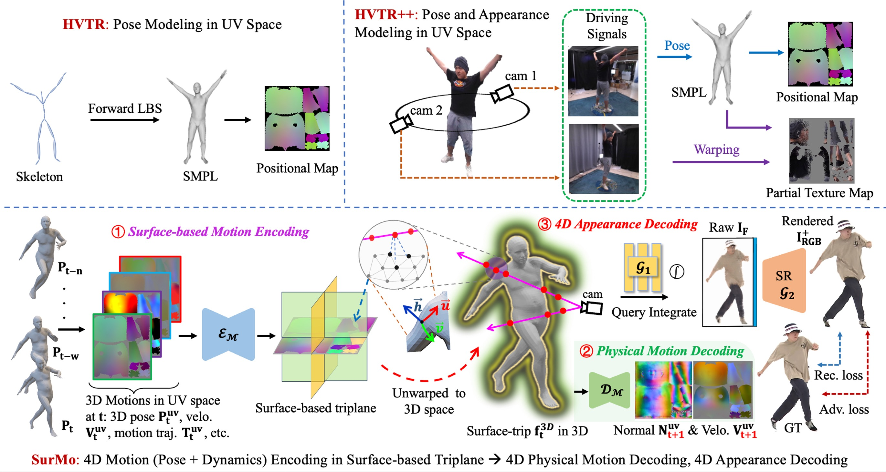

# Surface-Based Motion Modeling for Dynamic Human Rendering



We propose SurMo, a new paradigm for learning dynamic human rendering from videos by jointly modeling the temporal motion dynamics and human appearances in a unified framework based on a novel surface-based triplane. We extend the existing well-adopted paradigm of "Pose Encoding → Appearance Decoding" to "Motion Encoding → Physical Motion Decoding, Appearance Decoding".

This repository contains the code of SurMo that is built upon HVTR and HVTR++.

**SurMo: Surface-based 4D Motion Modeling for Dynamic Human Rendering**  
Tao Hu, Fangzhou Hong, Ziwei Liu  
CVPR 2024
[[Project Page]](https://taohuumd.github.io/projects/SurMo) [[Video]](https://www.youtube.com/watch?v=m_rP5HwL53I) [[Paper]](https://arxiv.org/pdf/2404.01225.pdf) 


**HVTR++: Image and Pose Driven Human Avatars using Hybrid Volumetric-Textural Rendering**  
Tao Hu, Hongyi Xu, Linjie Luo, Tao Yu, Zerong Zheng, He Zhang, Yebin Liu, Matthias Zwicker  
TVCG 2023
[[Project Page]](https://TaoHuUMD.github.io/projects/hvtrpp/) [[Video]](https://youtu.be/RdKLfRYtg3I) [[Paper]](https://ieeexplore.ieee.org/document/10190111) 

**HVTR: Hybrid Volumetric-Textural Rendering for Human Avatars**  
Tao Hu, Tao Yu, Zerong Zheng, He Zhang, Yebin Liu, Matthias Zwicker  
3DV 2022
[[Project Page]](https://TaoHuUMD.github.io/projects/hvtr/) [[Video]](https://youtu.be/LE0-YpbLlkY?si=DfXp4vLKUVGCJlKG) [[Paper]](https://arxiv.org/pdf/2112.10203.pdf)


# Instructions

## Test Results
To facilitate comparisons with our model in subsequent work, we have saved our rendering results of ZJU-MoCap on [OneDrive](https://1drv.ms/f/c/cd958c29ffd57ddb/Ett91f8pjJUggM1-DQAAAAAB892JXlTtzxmciQIh0MC3bg?e=r1HjCH)


## Installation
NVIDIA GPUs are required for this project. We have trained and tested code on NVIDIA V100.  We recommend using anaconda to manage the python environments.

```bash
conda create --name surmo python=3.9
conda install pytorch==1.10.1 torchvision==0.11.2 cudatoolkit=11.1 -c pytorch
conda install -c fvcore -c iopath -c conda-forge fvcore iopath
conda install pytorch3d -c pytorch3d
pip install -r requirements.txt
```

## Test

### Download Models & Assets & Datasets

Download the pretrained models and necessary assets from [OneDrive](https://1drv.ms/f/c/cd958c29ffd57ddb/EsqvoFUGhCpIpuT10AaBDkMBb_ACQRf-dgjiC1FviCCFsA?e=IK007Z). Put them in *DATA_DIR/result/trained_model* and *DATA_DIR/asset* respectively. *DATA_DIR* is specified as *./data* in default.

Download [ZJU-MoCap](https://github.com/zju3dv/neuralbody/blob/master/INSTALL.md#zju-mocap-dataset) dataset and put it in the folder *zju_mocap* (e.g., *DATA_DIR/zju_mocap/CoreView_3XX*)
 
Register and download SMPL models [here](https://smpl.is.tue.mpg.de/). Put them in the folder *smpl_data*.

The folder structure should look like

```
DATA_DIR
└── asset/
    ├── smpl_data/
        └── SMPL_NEUTRAL.pkl
    ├── uv_sampler/
    ├── uv_table.npy
    ├── smpl_uv.obj
    ├── sample_data.pkl
├── dataset
    ├──zju_mocap/
├── result/
    ├── trained_model/modelname/
        └──xx.pth
    ├── test_output

```

### Commands

The test script for models (313, 315, 377, 386, 387, 394) trained on ZJU-MoCap.
```bash
bash scripts/zju/3XX_test.sh [gpu_ids]
```
i.e., bash scripts/zju/313_test.sh or bash scripts/zju/313_test.sh 0

The test results will be found in *DATA_DIR/result/*. An example rendering result is shown in *docs/figs/test_example.jpg*, which includes a generated image, ground truth image, positional map, predicted normal map, and low resolution NeRF renderings.

## Training

### Commands
The training script for subjects (313, 315, 377, 386, 387, 394) on ZJU-MoCap.
```bash
bash scripts/zju/3XX_train.sh [gpuids]
```
i.e., bash scripts/zju/313_train.sh or bash scripts/zju/313_train.sh 0,1,2,3

The trained models will be saved in *DATA_DIR/result/trained_model/*.
## License

Distributed under the S-Lab License. See `LICENSE` for more information.

## Citation
```bibtex
  @misc{hu2024surmo,
      title={SurMo: Surface-based 4D Motion Modeling for Dynamic Human Rendering}, 
      author={Tao Hu and Fangzhou Hong and Ziwei Liu},
      year={2024},
      eprint={2404.01225},
      archivePrefix={arXiv},
      primaryClass={cs.CV}
  }

  @ARTICLE{hu2023hvtrpp,
      author={Hu, Tao and Xu, Hongyi and Luo, Linjie and Yu, Tao and Zheng, Zerong and Zhang, He and Liu, Yebin and Zwicker, Matthias},
      journal={IEEE Transactions on Visualization and Computer Graphics}, 
      title={HVTR++: Image and Pose Driven Human Avatars using Hybrid Volumetric-Textural Rendering}, 
      year={2023}
  }

  @inproceedings{hu2022hvtr,
      title={HVTR: Hybrid Volumetric-Textural Rendering for Human Avatars},
      author={Hu, Tao and Yu, Tao and Zheng, Zerong and Zhang, He and Liu, Yebin and Zwicker, Matthias},
      booktitle = {2022 International Conference on 3D Vision (3DV)},
      year = {2022}
}
```